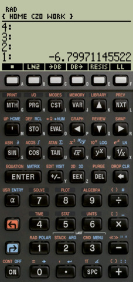

## 48sx : The HP48 sx emulator !

HP48sx is a vintage RPN calculator. I used this calc 25 years ago ;-) I love this calc....and 
now I can have it in my pocket every day !

HP48sx emulator for Android, released on the Play Store. The bundled ROM is free for non
commercial use. No nag, no Ad, completely FREE!

- Play Store: https://play.google.com/store/apps/details?id=org.czo.droid48sx
- Old releases apk: https://github.com/czodroid/droid48sx/releases
- Sources code: https://github.com/czodroid/droid48sx

48sx is a modified version of droid48 but for the HP48 SX, the credit goes to Arnaud Brochard
(author of droid48 for Android), and of course Eddie C. Dost (author of x48 for UNIX) who
created an emulator of the Saturn processor in 1990.

Please read the [changelog](CHANGELOG)...

