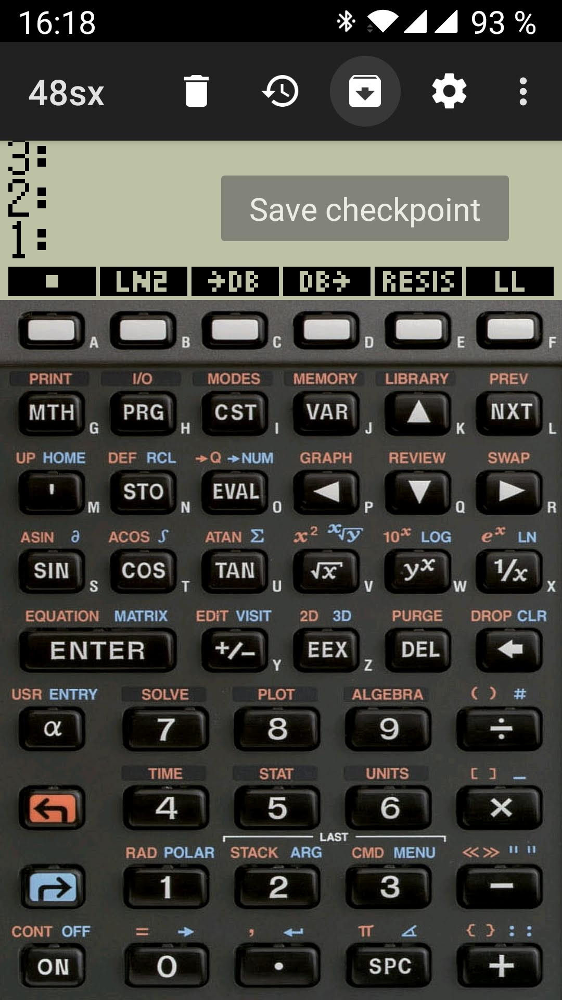

48sx : The HP48 sx emulator !

HP48sx is a vintage RPN calculator. I used this calc 25 years ago ;-) I love this calc....and now I can have it in my pocket every day !

No nag, no Ad, completely FREE!

HP48sx emulator for Android, released on the Android Market. The bundled ROM is free for non commercial use.

https://play.google.com/store/apps/details?id=org.czo.droid48sx

Droid48sx is a modified version of droid48 but for HP48 SX, credit goes to Arnaud Brochard (author of droid48 for Android)
and of course Eddie C. Dost (author of x48 for UNIX). If you came from Windows, and like Emu48 (written by Sebastien Carlier
and Christoph Gießelink), you can also get Emu48 for Android (written by Regis Cosnier)
